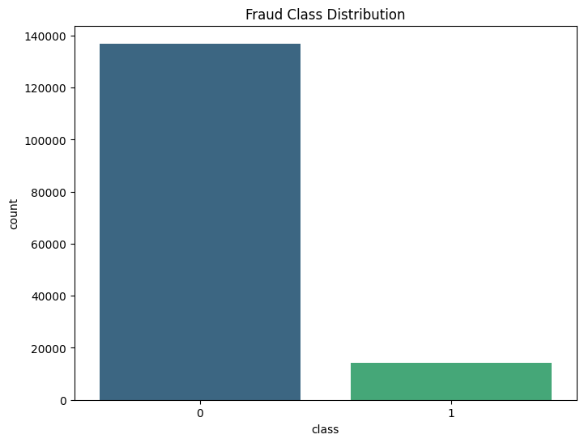
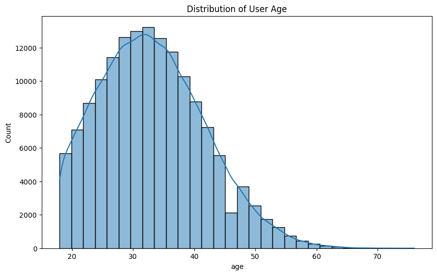
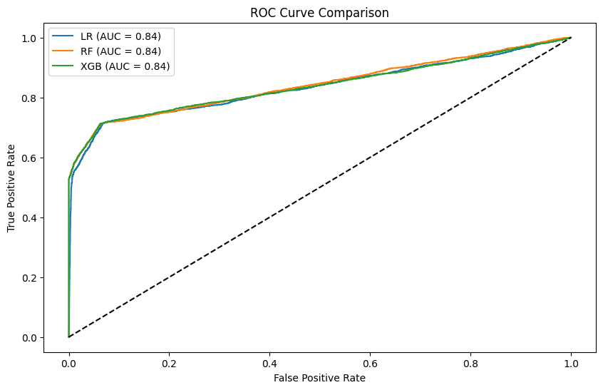
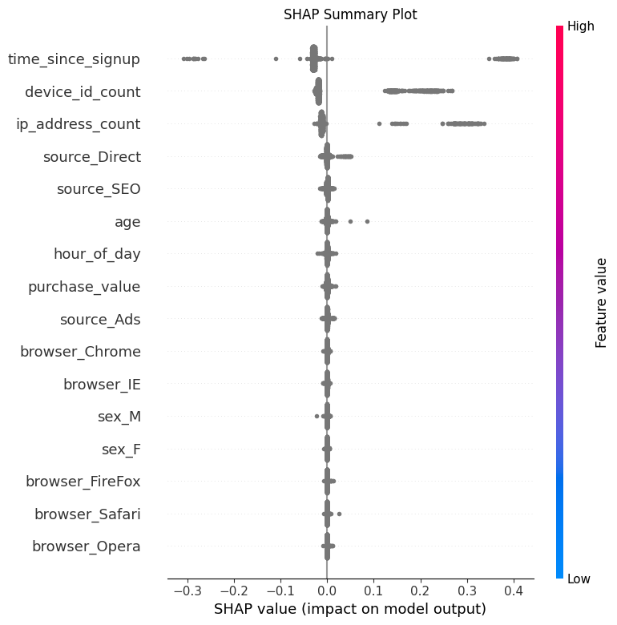

# Improved Detection of Fraud Cases for E-commerce and Bank Transactions

This project aims to detect fraudulent transactions by analyzing e-commerce and bank transaction data. It covers the full machine learning lifecycle, from data analysis and preprocessing to model building, evaluation, and explainability.

## Project Structure
```
fraud-detection/
├── data/
│   ├── raw/                # Original datasets
│   └── processed/          # Cleaned and feature-engineered data
├── notebooks/              # Jupyter notebooks for EDA and modeling
├── scripts/                # Python scripts for report generation and explainability
├── src/                    # Source code for data processing and utility functions
├── report/
│   ├── images/             # Generated plots and visualizations
│   └── stats/              # Generated statistical reports and CSVs
├── models/                 # Saved models
├── requirements.txt        # Python dependencies
└── README.md               # Project documentation
```

## Task 1: Data Analysis and Preprocessing

The objective of Task 1 was to prepare clean, feature-rich datasets. Key steps included:

1.  **Data Cleaning**: Handled missing values (imputed/dropped), removed duplicates, and corrected data types.
2.  **Geolocation Integration**: Mapped IP addresses to countries using range-based lookups to identify high-risk regions.
3.  **Feature Engineering**:
    *   **Time-based features**: `hour_of_day`, `time_since_signup` (duration between signup and purchase).
    *   **Frequency features**: `device_id_count` (number of unique user accounts associated with a device ID), `ip_address_count`.
4.  **Handling Class Imbalance**: The dataset was highly imbalanced.
    *   **Original Distribution**:
        *   Non-Fraud (0): **90.6%**
        *   Fraud (1): **9.4%**
    *   **Strategy**: SMOTE (Synthetic Minority Over-sampling Technique) was considered, but stratified sampling was used for model input to maintain distribution integrity during evaluation.

### Key Visualizations


*Figure 1: Class distribution of the fraud dataset.*


*Figure 2: Age distribution of fraudulent vs. non-fraudulent users.*

---

## Task 2: Model Building and Training

We trained and evaluated multiple models to detect fraud, focusing on performance metrics suitable for imbalanced data (ROC AUC).

### Models Evaluated
1.  **Logistic Regression**: Baseline model.
2.  **Random Forest**: Ensemble bagging model.
3.  **XGBoost**: Gradient boosting model.

### Model Comparison Results

| Model | ROC AUC Score |
| :--- | :--- |
| **Random Forest** | **0.842** |
| XGBoost | 0.839 |
| Logistic Regression | 0.835 |

**Random Forest** was selected as the best performing model with an ROC AUC of **0.842**.

### ROC Curve Comparison

*Figure 3: ROC Curve comparison showing Random Forest slightly outperforming XGBoost and Logistic Regression.*

---

## Task 3: Model Explainability

To understand *why* the model classifies certain transactions as fraud, we used **SHAP (SHapley Additive exPlanations)**.

### Feature Importance
The most influential features driving fraud detection were:
1.  **time_since_signup**: Highly predictive; quick sign-up-to-purchase behavior is a strong fraud signal.
2.  **ip_address_count**: High reuse of IP addresses suggests bot/fraud ring activity.
3.  **device_id_count**: Multiple accounts on a single device indicates potential fraud.

**Top Feature Importance Table:**
| Feature | Importance Score |
| :--- | :--- |
| time_since_signup | 0.386 |
| ip_address_count | 0.318 |
| device_id_count | 0.270 |
| purchase_value | 0.007 |
| age | 0.006 |

### SHAP Summary

*Figure 4: SHAP Summary Plot visualizing the impact of features on model output.*

### Key Insights
*   **Time Since Signup**: Lower values (quick purchases) drastically increase fraud probability.
*   **Device/IP Counts**: Higher counts (shared resources) are positively correlated with fraud.

---

## Conclusion & Recommendations

1.  **Real-time Velocity Checks**: Implement strict rules or step-up authentication for transactions where `time_since_signup` is excessively short (e.g., < 1 minute).
2.  **Device Fingerprinting**: Flag accounts sharing a single `device_id` or `ip_address` beyond a small threshold (e.g., > 2 users).
3.  **Model Deployment**: Deploy the **Random Forest** model for batch or real-time scoring, as it offers the best trade-off between performance and interpretability.

## Setup Instructions

1.  Clone the repository.
2.  Install dependencies:
    ```bash
    pip install -r requirements.txt
    ```
3.  Run the report generation or explainability scripts:
    ```bash
    python scripts/generate_report.py
    python scripts/explain_models.py
    ```
